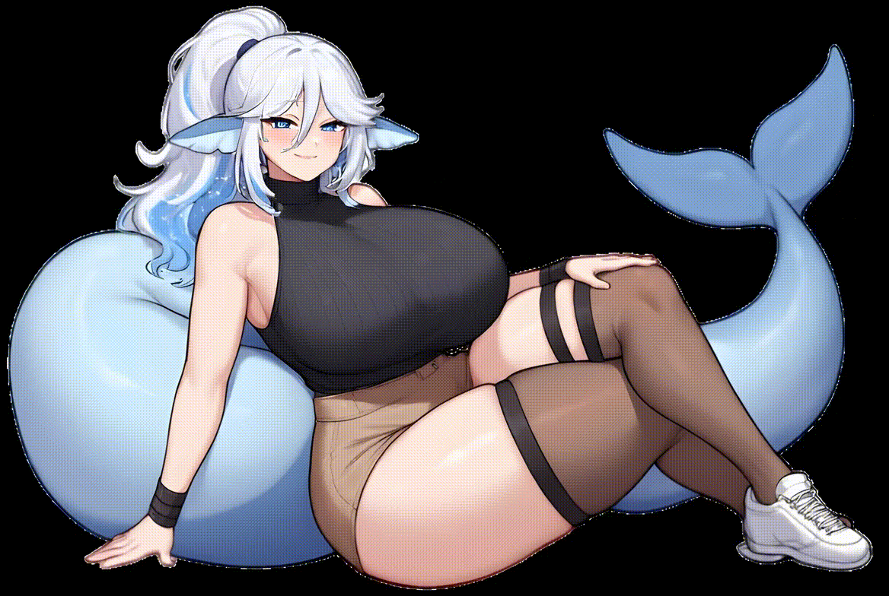
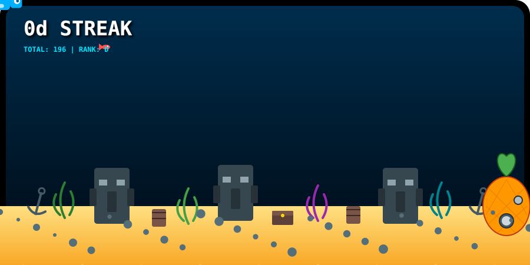

<!-- 🌊 CAPSULE RENDER — OCEAN WAVE HEADER -->

---

  <table border="0">
    <tr>
      <td style="border: 2px solid #00BFA5; border-radius: 20px; padding: 12px; background-color: #0D1B2A;">
        
      </td>
    </tr>
  </table>

  

 

---

## 🌊 OCEAN METAVERSE — LIVE WORLD

<!-- Layer 1: Sky & Boss -->

<!-- Layer 2: Sea & Whale -->

<!-- Layer 3: Map & Island -->

## 🗡️ `SKILL TREE — ABYSS EXPEDITION`

  

## 📊 `BATTLE STATS — AQUARIUM`

  

## 🐚 `SKILL RACE — ARSENAL BEACH`

  

---

